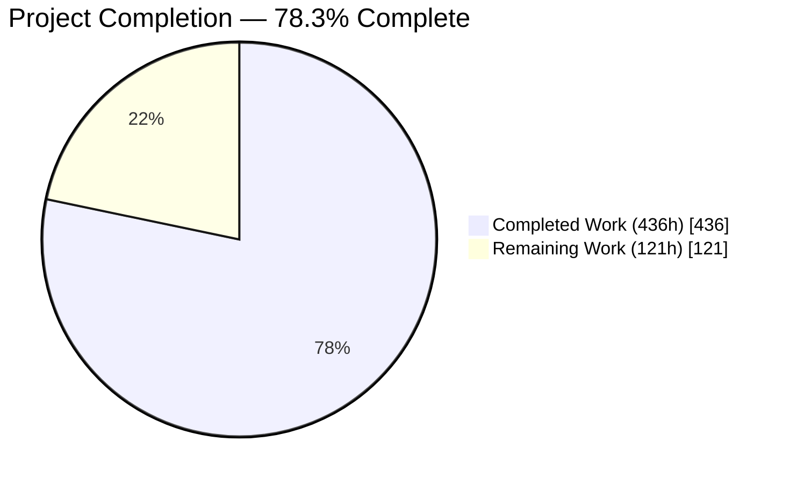
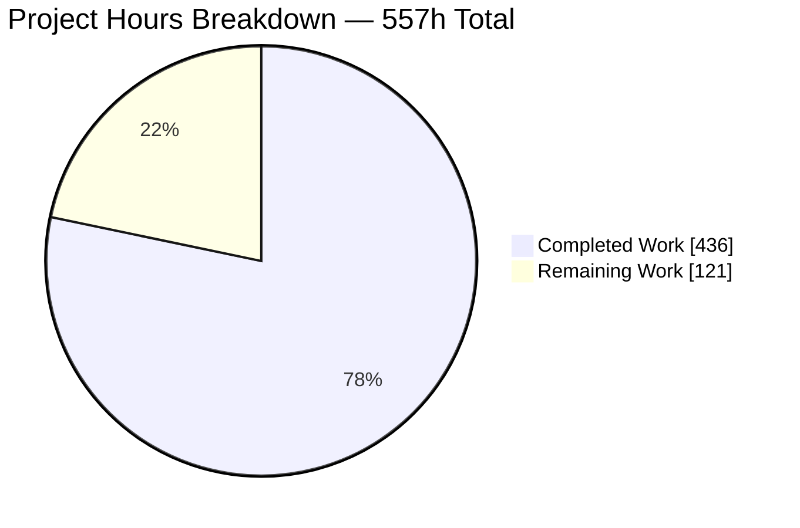
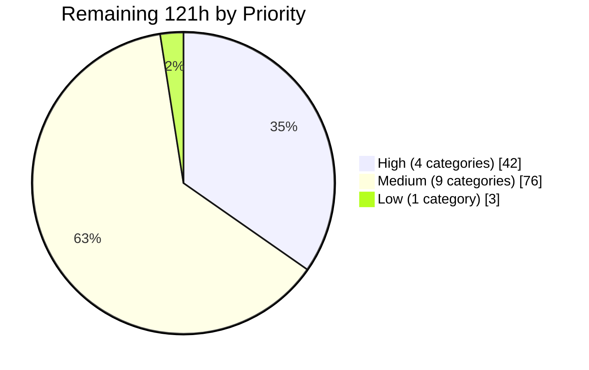
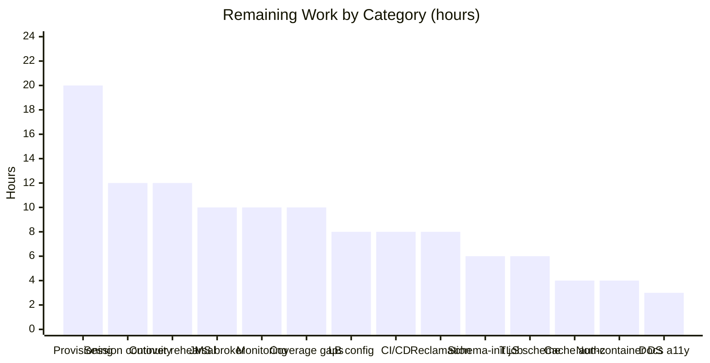
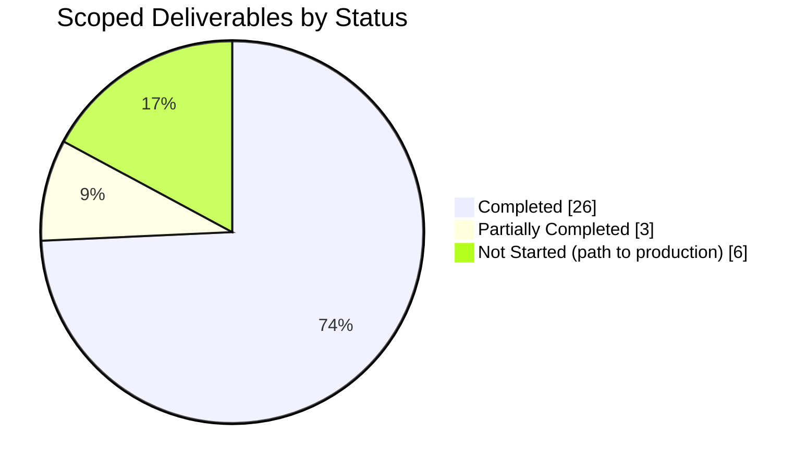

# 1. Executive Summary

## 1.1 Project Overview

This project makes the Apache OFBiz suite — the `ofbiz-framework` repository with its `ofbiz-plugins` submodule — deployable as a stateless, multi-instance service behind a load balancer, through code and configuration only. Managed PostgreSQL becomes the deployed default, secrets are supplied at run time, file-backed content moves to an S3-compatible object store, schema DDL is confined to one gated initialisation, and the fleet gains cache invalidation plus liveness and readiness endpoints. The data model, service definitions, API contracts and presentation layer are untouched, so every webapp behaves exactly as before. Users are operations teams deploying OFBiz on managed cloud infrastructure.

## 1.2 Completion Status



<!-- Chart colours: Completed = Dark Blue #5B39F3 · Remaining = White #FFFFFF -->

| Metric | Value |
|---|---|
| **Total Hours** | **557 h** |
| **Completed Hours (AI + Manual)** | **436 h** (436 h autonomous, 0 h manual) |
| **Remaining Hours** | **121 h** |
| **Percent Complete** | **78.3%** |

Scope covers the planned deliverables plus path-to-production work: `436 / (436 + 121) = 78.3%`.

## 1.3 Key Accomplishments

- ✅ Managed PostgreSQL serves both production delegators from the environment; `test` and a bare checkout stay on embedded H2.
- ✅ No secret exists in the repository or the image, and the image build fails if one appears.
- ✅ Production start-up refuses to serve without its four secrets, valid database coordinates and a cookie-safe instance route.
- ✅ Content and uploads publish transactionally to an S3-compatible store; database storage remains the default.
- ✅ Schema DDL runs only in a one-shot initialisation; serving instances issue none and need no DDL privilege.
- ✅ Liveness and readiness answer in milliseconds, create no session, and reflect the dependencies actually configured.
- ✅ Entity caches stay coherent across instances, with exactly one subscription per instance.
- ✅ 2,254 automated tests pass with zero failures; every frozen surface is byte-identical to the base revision.

## 1.4 Critical Unresolved Issues

| Issue | Impact | Owner | ETA |
|---|---|---|---|
| Content objects outlive the rows that name them — removing a `DataResource` does not reclaim its stored object | Object storage grows without bound unless a lifecycle rule or reconciliation job is configured. The key derivation needed to do so is documented | Platform / Operations | 8 h |
| HTTP session state is instance-local; `apps-distributable` remains false and `jvm-route` is routing metadata only (`framework/catalina/ofbiz-component.xml:37-54`) | Replacing or restarting an instance signs its users out. Needs route-cookie affinity at the balancer, or a decision to adopt replicated sessions | Architecture | 12 h |
| Five exported entity-cache services require authentication but no permission, so any token holder can invoke them (upstream behaviour inside a frozen surface) | With cache invalidation enabled, one call invalidates every instance's caches. Needs a policy decision or an approved scope amendment | Security | 4 h |
| Four delivered code paths are not exercised at run time (filesystem readiness on an unreachable mount, encryption with a customer-managed key, the mid-transfer stream reset, two content-absence branches) | Each is unit-covered but unproven against real infrastructure; exercise the encryption path before enabling it | QA | 10 h |
| Absolute REST and OpenAPI URLs report `http` behind a TLS-terminating proxy | An integrator following a discovered link can leave TLS. Three ranked operator remedies are documented; the code fix needs a frozen surface | Architecture | 6 h |

## 1.5 Access Issues

| System/Resource | Type of Access | Issue Description | Resolution Status | Owner |
|---|---|---|---|---|
| Managed PostgreSQL instance | Database credentials, two roles | No managed instance exists yet. Deployment needs a DDL-owner role for the initialisation job and a DML-only role for serving, with the two default-privilege grants applied | Outstanding — procedure documented and every statement in it verified | Platform |
| S3-compatible object store | Bucket, access policy, credentials or instance role | No bucket is provisioned. A per-deployment key prefix is required so two deployments cannot collide on one bucket | Outstanding — configuration surface complete | Platform |
| Platform secret store | Secret injection | The four required deployment secrets must be supplied on every start. Per-secret file inputs are implemented and documented but not yet wired to a secret store | Outstanding | Platform / Security |
| JMS broker | Broker endpoint, credentials, topic ACL | Cache invalidation needs a broker with TLS, authentication, a least-privilege topic ACL and a JMS 2.0 client library. Start-up already refuses the feature without an active transport | Outstanding — feature off by default | Platform |
| Load balancer / target group | Configuration access | Probe path, a probe timeout above the instance readiness deadline, route-cookie affinity and TLS termination are not yet configured | Outstanding | Platform |

No repository, toolchain or registry access issues exist: build, data load, both test tiers, the container build and the application all run end to end.

## 1.6 Recommended Next Steps

1. **[High]** Provision the managed database, the object-store bucket with a key prefix, and the secret store wiring — 20 h.
2. **[High]** Configure the load balancer: probe path, probe timeout above the readiness deadline, route-cookie affinity, TLS termination — 8 h.
3. **[High]** Orchestrate the one-shot schema initialisation and gate the rollout on its exit status — 6 h.
4. **[High]** Decide and implement content-object reclamation — 8 h.
5. **[Medium]** Settle the three open architecture decisions: session continuity, cache-service authorization, TLS-proxy URL scheme — 22 h.

# 2. Project Hours Breakdown

## 2.1 Completed Work Detail

Every component below traces to a specific deliverable in the project scope and is evidenced by a repository path, a test suite or a runtime observation.

| Component | Hours | Description |
|---|---:|---|
| Managed PostgreSQL datasource profile and template | 36 | `framework/entity/config/entityengine.xml` and `docker/templates/postgres-entityengine.xml`: profile split keeping a bare checkout on embedded H2, the `test` delegator pinned to H2 in both files, 16 substitution tokens for host/port/three databases/three users/three passwords/pool bounds/DDL flags/cache-clear flag, bounded connection deadlines, and the PostgreSQL JDBC driver pinned in `dependencies.gradle` in place of a start-time download |
| Container entry point configuration rendering and fail-fast validation | 60 | `docker/docker-entrypoint.sh` (1,995 lines): renders the datasource, secret, object-store, load-balancer and schema-init configuration into owner-only `config/` copies; validates 51 deployment variables — whitespace and padding, TCP port range, absolute-origin grammar, provider enumeration, bucket naming, JMS URI credentials, instance-route character set — and refuses before the JVM starts, never echoing a value |
| Secret externalisation and image hygiene | 16 | Blank signing-key anchors (`framework/security/config/security.properties:172,198`), the admin-key literal removed (`start.properties:77`), and two `Dockerfile` guards: the build fails if a committed anchor carries a value, and the runtime image is asserted to contain no `security.properties` with a filled key |
| Content-storage provider layer | 84 | `applications/content/src/main/java/org/apache/ofbiz/content/data/store/` (3,351 lines): the `ContentStore` SPI, a configuration-driven factory defaulting to database storage, a filesystem provider preserving legacy upload behaviour, an S3-compatible provider with endpoint override, path-style addressing, bounded transfer deadlines and a pinned retry strategy, and a publisher that binds publication to the recording transaction with rollback compensation |
| Content read/write seam and bounded streaming | 32 | A signature-preserving seam in `DataResourceWorker.java`; fixed-buffer streaming and hardened response headers in `DataEvents.java`; multipart staging released at end of request in `UtilHttp.java` and `ControlServlet.java` so no instance retains upload state |
| Gated single schema initialisation | 20 | The one-shot initialisation gate: a singleton lock, an aggregated verdict combining loader status, a failure scan and a per-group check count against the rendered configuration, an idempotent re-initialisation path, and restoration of run mode on every failure leg |
| Health and readiness endpoints | 28 | `HealthCheckServlet.java` (950 lines) registered as both filter and servlet in `framework/webtools/webapp/webtools/WEB-INF/web.xml`: exact-path matching, configuration-aware readiness with per-dependency deadlines and a verdict cache, rate-limited reasons kept out of the response body, and session-free responses |
| Multi-instance coherence and TLS-proxy handling | 28 | Environment-configurable `jvm-route`, `ssl-accelerator-port` and cross-subdomain sessions in `framework/catalina/ofbiz-component.xml`; a reworked session-cookie valve applying the domain through Tomcat's own API; single-instance JMS listener construction; cache invalidation gated on a proven transport; a corrected graceful-shutdown helper; and bounded SDK log routing |
| Entity-layer error disclosure sanitisation | 8 | `SQLProcessor.java` and `GenericDAO.java`: client-facing datasource failures carry an opaque correlation reference while the statement, entity name and primary key go to the log |
| Focused automated test suites | 52 | 115 tests across six suites, 3,431 lines: `ContentStoreFactoryTest` (47), `SchemaInitGatingTests` (41), `HealthCheckServletTests` (22), `SecurityUtilTest` (10), `DataEventsTests` (3), `JmsListenerFactoryTests` (2) |
| Operator deployment guide | 32 | `DOCKER.adoc` grew from 278 to 2,085 lines: every deployment variable, the schema-initialisation procedure, a two-role least-privilege database procedure whose every statement was executed before being written, object-storage configuration, JMS topic naming, and responsive/accessible rendering of the generated HTML |
| Acceptance-gate validation across real infrastructure | 40 | The scope's thirteen validation gates exercised against real PostgreSQL, an S3-compatible store, a JMS broker, a TLS-terminating proxy, a two-instance fleet and a browser — including a database audit proving a serving instance issues no DDL and a serving role that provably cannot create a table |
| **Total** | **436** | |

## 2.2 Remaining Work Detail

| Category | Hours | Priority |
|---|---:|---|
| Managed database, object store and secret provisioning (two roles with default privileges, bucket policy, per-deployment key prefix, secret injection) | 20 | High |
| Load-balancer, target-group and TLS-termination configuration | 8 | High |
| One-shot schema-init job orchestration and rollout gating | 6 | High |
| Content-object reclamation decision and lifecycle implementation | 8 | High |
| Session continuity across instance replacement | 12 | Medium |
| JMS broker provisioning for distributed cache invalidation | 10 | Medium |
| Exported cache-service authorization decision | 4 | Medium |
| Non-container managed-PostgreSQL datasource configuration | 4 | Medium |
| TLS-proxy absolute-URL scheme decision | 6 | Medium |
| Test coverage for the four unexercised code paths | 10 | Medium |
| CI/CD pipeline and the post-load signing-key restore rule | 8 | Medium |
| Monitoring, alerting and log shipping | 10 | Medium |
| Production smoke test and cutover rehearsal | 12 | Medium |
| Generated-documentation accessibility completion | 3 | Low |
| **Total** | **121** | |

Priority split: High 42 h across 4 categories, Medium 76 h across 9 categories, Low 3 h across 1 category.

## 2.3 Human Task List

Each task rolls up into exactly one category above, and the task hours sum to the same 121 h.

| # | Priority | Task | Hours |
|---|---|---|---:|
| H1 | High | Provision the managed PostgreSQL instance(s) and create the DDL-owner and DML-only serving roles per the documented procedure, including the two default-privilege grants | 8 |
| H2 | High | Provision the object-store bucket, its access policy, a per-deployment key prefix and the credentials or instance role | 6 |
| H3 | High | Wire the four required deployment secrets into the platform secret store using the per-secret file inputs, and rehearse rotation | 6 |
| H4 | High | Configure the load balancer: readiness probe path, probe timeout above the instance deadline, route-cookie affinity, TLS termination, per-instance route | 8 |
| H5 | High | Orchestrate the one-shot schema-init job with run-once semantics, the singleton acknowledgement, and a rollout gated on its exit status | 6 |
| H6 | High | Decide and implement content-object reclamation: a bucket lifecycle rule or a reviewed reconciliation job using the documented key derivation | 8 |
| M1 | Medium | Decide whether the fleet must survive instance replacement; if so, approve and configure replicated or external session storage and re-verify sign-in continuity | 12 |
| M2 | Medium | Provision the JMS broker: TLS with host-name verification, authentication, a least-privilege topic ACL, and a JMS 2.0 client library in `lib-extra` | 10 |
| M3 | Medium | Decide the exported cache-service authorization posture: keep the REST service surface off untrusted networks, or approve adding the administrative permission requirement | 4 |
| M4 | Medium | For any non-container managed-PostgreSQL deployment, supply the datasource host, database, user and password locally or through a password lookup | 4 |
| M5 | Medium | Decide the TLS-proxy URL-scheme remedy: terminate TLS on the application's own https connector, or approve a scope extension for scheme-aware URL building | 6 |
| M6 | Medium | Add coverage for the four unexercised paths: filesystem readiness on an unreachable mount, server-side encryption with a KMS key, the mid-transfer stream reset, and the two remaining content-absence branches | 10 |
| M7 | Medium | Build the CI/CD pipeline: the two acceptance commands as gates, image publish, and an explicit step restoring the signing-key file after any data load | 8 |
| M8 | Medium | Ship logs and add alerting on readiness transitions, connection-pool headroom and correlated content-store failure references | 10 |
| M9 | Medium | Rehearse the cutover on a two-instance fleet: replacement, failover, cache coherence, object round trip and rollback | 12 |
| L1 | Low | Complete the generated-guide accessibility items (main landmark, column header scope, locally hosted icon font) if the remaining audit points matter | 3 |
| | | **Total** | **121** |

# 3. Test Results

Every figure below was produced by executing the project's own two acceptance commands — `./gradlew build` and `./gradlew cleanAll loadAll testIntegration` — on the current tree and reading the JUnit result files they wrote. The unit tier reported 70 suites and 541 tests; the integration tier reported 42 suites and 1,713 tests. Both completed with zero failures, zero errors and zero skipped tests.

| Area / Category | Framework | Tests | Passed | Failed | Coverage | What This Proves |
|---|---|---:|---:|---:|---|---|
| Content-storage providers and factory | JUnit 5 + Mockito | 47 | 47 | 0 | Not instrumented | Provider selection defaults to database storage, key grammar and byte limits hold, and filesystem and S3 read/write/absence/overwrite paths behave to contract |
| Schema-init gating and configuration contracts | JUnit 5 | 41 | 41 | 0 | Not instrumented | Managed datasources ship with startup DDL disabled in both the committed configuration and the rendered template, the `test` delegator stays on H2, and the entry point's rendering and refusal rules hold |
| Health and readiness endpoints | JUnit 5 + Mockito | 22 | 22 | 0 | Not instrumented | Liveness always answers, readiness reports only the dependencies a deployment configures, deadlines and verdict caching bound the response, and no reason text reaches the body |
| Upload allow-list and signing-key anchors | JUnit 5 | 10 | 10 | 0 | Not instrumented | The canonical upload root is accepted while traversal and out-of-root paths are refused |
| Content streaming response contract | JUnit 5 | 3 | 3 | 0 | Not instrumented | Active formats are served as attachments, inert formats inline, and a recorded file name cannot inject a header parameter |
| JMS listener construction | JUnit 5 | 2 | 2 | 0 | Not instrumented | One JVM constructs at most one listener factory, so a topic gains exactly one subscription per instance |
| Remaining framework and application unit tier | JUnit 5 | 416 | 416 | 0 | Not instrumented | The pre-existing unit baseline — entity model, service engine, widget renderers, HTTP utilities, REST resources — is unaffected |
| Full integration tier (42 suites) | OFBiz test loader on the H2 `test` delegator | 1,713 | 1,713 | 0 | Not instrumented | Entity, service, webapp, content, accounting, order, product, party and REST behaviour is identical to the pre-change baseline, and the `test` delegator still resolves to embedded H2 |

Static quality gates were run alongside the suites: `checkstyleMain`, `checkstyleTest`, `codenarcMain` and `codenarcTest` all complete with zero violations.

No code-coverage tool is configured in this repository — there is no JaCoCo or equivalent task in the build — so no coverage percentage is available for any row above. Adding instrumentation would be a build change outside this project's scope.

### Not Covered

The following delivered behaviour is not exercised by any automated test or runtime check and should be tested before release:

- **Filesystem readiness on an unreachable mount.** The readiness hook's filesystem path is unit-covered through its writable-ancestor walk, but a hung or unmounted shared upload directory was never simulated. Relevant only if uploads are placed on a network mount.
- **Server-side encryption with a customer-managed key.** The encryption code path is shared by both store-write overloads and is unit-covered, but no key-management endpoint was available, so it has never run end to end. Exercise it before enabling encryption in production.
- **Mid-transfer stream failure during a content read.** The pre-commit absence and missing-object paths are covered; the narrow window in which the store fails after the response has begun but before it commits was never forced, so its fallback status is unproven.
- **Two of the seven content-absence branches.** The absence helper is unit-covered and was exercised at run time through the local-file path; the context-file and raw-stream branches call the same helper with the same arguments but were not driven individually.
- **Object-store write round trip on the final tree.** The provider layer's 47 tests and earlier runs against a real S3-compatible store cover this path, and the container run proved the configuration reaches the application, but a browser-driven upload-then-read was not repeated against the final revision.
- **Session continuity across instance replacement.** Sticky routing is verified, but no automated test asserts what happens to a signed-in user when an instance is replaced, because replicated sessions are not part of this design.

# 4. Runtime Validation &amp; UI Verification

The application was started in its zero-configuration development profile and driven with both an HTTP client and a real browser; the deployed profile was exercised as a two-instance fleet against managed PostgreSQL, an S3-compatible object store, a JMS broker and a TLS-terminating proxy.

- ✅ **Start-up, development profile** — `./gradlew ofbiz` reaches a serving state in about 100 seconds on embedded H2 with no environment variables and no secrets. `ofbiz --shutdown` returns cleanly and releases the ports.
- ✅ **Liveness probe** — `GET /webtools/health/live` answers HTTP 200 with the body `{"status":"UP"}`, `application/json`, `cache-control: no-store` and the full security header set, in single-digit milliseconds and with **no `Set-Cookie`**.
- ✅ **Readiness probe** — `GET /webtools/health/ready` answers HTTP 200 with `{"status":"UP","database":"UP"}` after a live database query, again with no cookie. On the deployed fleet the body additionally reports the configured object store and message bus; each dependency outage flips it to 503 within its deadline while liveness stays 200, and it returns to 200 on the next probe after recovery.
- ✅ **Probe surface isolation** — the two exact paths are the only ones that report health. `/webtools/health`, `/webtools/health/` and `/webtools/healthz/live` take ordinary routing (302); `/webtools/health/live/extra` and both `/webtools/control/health/*` spellings answer a bare 404; `POST` answers 405 with `Allow: GET, HEAD`. An ordinary page on the same instance sets three cookies, so the session-free behaviour of the probes is a genuine property and not an artefact.
- ✅ **Authentication and Web Tools** — signing in as the administrator renders the authenticated Web Tools page with its full tool menu (Entity Engine, Service Engine, Cache Maintenance, Logging) and a delegator name of `default`.
- ✅ **Business webapps** — Party Manager, Catalog Manager, Content Manager, Order Manager, Accounting and the remaining back-office webapps all render authenticated with real data: a no-criteria party search returns 156 rows across 8 pages, the catalog tree lists the five demo catalogs, and Content Manager lists eight web sites. Each answers HTTP 401 before sign-in, which is the pre-existing convention.
- ✅ **Managed PostgreSQL deployed profile** — two instances served every webapp, the health endpoints, REST and the content route against PostgreSQL as a DML-only role. A database audit recorded **zero DDL statements** for an instance's entire life, and a role that provably cannot create a table still booted and served.
- ✅ **Gated schema initialisation** — the one-shot run created the full schema across the main, OLAP and tenant groups and exited without serving; a wrong credential and a privilege-less role each exit non-zero with no success banner and run mode restored.
- ✅ **Object store** — content published to an S3-compatible store round-trips byte-identically, an instance with no local copy still serves the content, repeated updates leave exactly one object per resource, and with the provider unset writes go straight to local storage with the client entirely inert.
- ✅ **Distributed cache invalidation and sticky routing** — one publication reaches both instances exactly once over a real broker, a peer reads new content with no manual cache clear, and each instance's session cookie carries its own route. Across the whole exercise there were **zero 5xx responses and zero application-generated JavaScript errors**.

**Not exercised at run time:** server-side encryption with a customer-managed key, filesystem readiness against a hung network mount, the mid-transfer stream-failure window, and session continuity across instance replacement. The only sub-400 anomalies observed anywhere were two pre-existing upstream gaps unrelated to this work — a missing English localisation asset requested by the stock theme on every page, and a favicon request — together with the expected 401 responses on login views.

# 5. Compliance &amp; Quality Review

## 5.1 Compliance Matrix

Each row shows where the deliverable stands now, with the evidence a reader can open.

| Deliverable | Benchmark | Status | Evidence |
|---|---|---|---|
| Managed PostgreSQL as the deployed default | Environment-driven coordinates; embedded H2 preserved for a bare checkout | ✅ PASS | `docker/templates/postgres-entityengine.xml:109-126`; `framework/entity/config/entityengine.xml:88-104` |
| `test` delegator remains on embedded H2 | Integration tier unaffected | ✅ PASS | `entityengine.xml:101-104`, template `:123-126`; 1,713 integration tests run on H2 |
| Multi-database portability retained | H2, MySQL and Oracle definitions and all dialect mappings intact | ✅ PASS | 23 datasource definitions present; `framework/entity/fieldtype/` unchanged (12 files) |
| No secret in the repository or the image | Anchors blank; build refuses a filled key | ✅ PASS | `framework/security/config/security.properties:172,198`; `start.properties:77`; `Dockerfile:63-71,113-116` |
| Secrets supplied at run time with fail-fast | Production start refuses without the required set | ✅ PASS | `docker/docker-entrypoint.sh:1051-1055` (secrets), `:684-690` (database), `:1000-1003` (store endpoint) |
| Object storage for content and uploads | S3-compatible provider behind an SPI; database storage default | ✅ PASS | `applications/content/.../data/store/` (5 classes, 3,351 lines); `content.properties:70` |
| New object-storage code isolated | One package, one importer of the SDK, one seam into existing code | ✅ PASS | `S3ContentStore.java` is the sole SDK importer; `DataResourceWorker.java` is the only caller |
| Startup DDL confined to a single gated run | Serving instances issue no DDL and need no DDL privilege | ✅ PASS | `entityengine.xml:522-523` and per-group equivalents; database audit recorded zero serving DDL |
| No migration framework introduced | Schema truth remains the entity model | ✅ PASS | No Flyway, Liquibase, version table or hand-written DDL anywhere in the change set |
| Health and readiness endpoints for target-group checks | Unauthenticated, session-free, exact-path | ✅ PASS | `HealthCheckServlet.java`; `framework/webtools/webapp/webtools/WEB-INF/web.xml:44-112` |
| Distributed cache coherence across instances | Configuration-driven, default off, transport enforced | ✅ PASS | `entityengine.xml:88,94`; template `:109,115`; one delivery per instance measured against a real broker |
| Immutable interfaces preserved | Data model, service definitions, REST/SOAP contracts, widgets, templates, themes, field types, component load order, plugins submodule | ✅ PASS | `git diff` against the base revision over every frozen path returns nothing; submodule pointer unchanged |

Quality benchmarks: the full build, both test tiers, Checkstyle (main and test) and CodeNarc (main and test) all pass with zero violations; no placeholder, stub, deferred-work marker or credential literal appears on any of the 13,523 added lines.

## 5.2 AAP &amp; Rule Divergences and Gaps

No user-specified rules were supplied for this project, so the agreed baseline is the plan itself. Eight divergences from it were identified.

| What the Plan Required | What Was Delivered Instead | Why It Diverged | Impact | Remediation |
|---|---|---|---|---|
| §0.7.2 freezes the internal behaviour of the Entity engine beyond the named configuration surfaces | `SQLProcessor.java` and `GenericDAO.java` changed so client-facing datasource failures carry an opaque reference instead of the statement and driver text | No configuration surface can alter a message the engine composes, and promoting PostgreSQL to the default made the disclosure reachable anonymously | Positive: a reconnaissance primitive is closed with no behavioural change | None required; optionally relocate to a presentation-layer handler if engine immutability must be restored |
| §0.4.1: readiness mirrors the `ping` service's row-count check on the sequencer entity | Readiness passes when the query runs, whatever it returns; an empty sequencer is reported ready and noted at info level | The literal reading deadlocks a fresh fleet — seed and demo rows carry explicit identifiers, so the table is empty and readiness never passes without traffic a balancer will not send | None negative; an uninitialised schema and an unreachable database both still fail readiness | Accept, or seed one identifier during schema initialisation |
| §0.2.1 enumerates an exhaustive change surface | Five further framework and application files changed: `DataEvents.java`, `UtilHttp.java`, `ControlServlet.java`, `JmsListenerFactory.java`, `AbstractJmsListener.java` | Each holds the root cause of a statelessness or stability condition that only this work's own objectives make reachable, and none is a frozen surface | Larger review surface than planned; all five are covered by the unit tier and by runtime verification | Review these five diffs specifically |
| §0.2.1 enumerates an exhaustive change surface (second group) | Four more files changed: `framework/base/config/log4j2.xml`, `CrossSubdomainSessionValve.java`, `Dockerfile`, `docker/send_ofbiz_stop_signal.sh` | Each is required to make a named objective actually work, or to keep a secret out of the image | Positive; each makes a capability the plan requires behave as specified | None required |
| Goal 3: content and uploads are held in object storage so instances hold no durable local state | Reads and writes reach the store; removing a `DataResource` row does **not** reclaim its object | Deletion runs through a frozen entity-auto service definition, and it never removed the local file either, so hard deletion would break the parity §0.7.1 requires | Storage grows unless managed externally; no data is lost | Bucket lifecycle rule or a reviewed reconciliation job using the documented key derivation (task H6) |
| §0.7.2 freezes existing service definitions | An administrative permission requirement on five exported cache services was reverted byte-identically to the base revision | No permitted layer exists to hold the control: the implementation is reference-only, the REST surface is excluded, and endpoint contracts are frozen | Residual and pre-existing: any authenticated principal can invoke them, and with invalidation enabled one call clears the whole fleet | Keep the REST service surface off untrusted networks, or approve an amendment (task M3) |
| §0.4.1: de-hardcode the managed datasource connection parameters in `entityengine.xml` | The committed definitions keep the upstream local-development literals; externalisation is delivered through the rendered template | The entity-configuration parser reads attributes literally with no placeholder expansion, so the template §0.6.1 prescribes is the only mechanism that works | A container is fully environment-driven; a non-container deployment must supply values itself | Edit the definitions locally or use a password lookup (task M4) |
| §0.7.1 minimal change: only the enumerated attributes | Eight further datasource attributes added — four connection deadlines and three pool attributes — and the idle validation statement removed | The values that apply without them are not bounded waits at all, so an instance reaching a stalled database would hang rather than fail its health check | Positive: every network wait is bounded and no pooled connection is left holding a transaction | None required |

**Entity-engine message sanitisation.** Making PostgreSQL the default changed what a failure discloses: an anonymous storefront request carrying a byte the driver rejects returned the whole `SELECT`, the schema-qualified table name and the driver's own error text, because seven throw sites in `SQLProcessor.java` embed the statement, with the nested cause carrying the driver text. `GenericDAO.java` held the same exposure on the insert path. A configuration change cannot reach a message the engine builds, so message construction itself changed: the caller receives a generic sentence plus `Reference [uuid]` and no nested cause, while the log records the statement, entity and primary key under that reference. No signature, exception type or control flow moved, and all 2,254 tests pass.

**Relaxed readiness predicate.** The plan asked readiness to mirror the `ping` service, which counts rows in the sequencer entity. Taken literally that deadlocks a fresh fleet: seed and demo data carry explicit identifiers, so the sequencer table is empty after a load, readiness answers 503 indefinitely, and a balancer sends no traffic until readiness passes — while only traffic would allocate the first identifier. Readiness therefore passes when the query executes, whatever it returns, noting an empty sequencer at info level (`HealthCheckServlet.java:674`). Every failure route the plan cared about survives: an uninitialised schema fails because the table is absent, and an unreachable database fails while liveness stays 200.

**Five root-cause files outside the enumerated surface.** `DataEvents.java` buffered a whole object per request, so concurrent reads of a legitimately sized object could exhaust the heap; it now streams through a fixed buffer with the response resolved before it is claimed. `UtilHttp.java` re-parsed an already-consumed multipart body and replaced the staged-file list with an empty one, leaving readable upload files that survived restarts — directly against the statelessness objective; `ControlServlet.java` now releases that staging at end of request. `JmsListenerFactory.java` constructed before its compare-and-set, allowing duplicate topic subscriptions, and `AbstractJmsListener.isConnected` was read across threads without a barrier. Review these five diffs deliberately, since they sit outside the planned file list.

**Four enabling files outside the enumerated surface.** `log4j2.xml` gained one logger bound, because the object-storage client this work introduces was writing request-signing material into the application log at root level. `CrossSubdomainSessionValve.java` was reworked because the flag the plan requires be configurable was inoperable — enabling it turned every session-bearing request into a silent empty 500 while readiness still reported healthy; the widening domain now comes from configuration and is applied through Tomcat's own cookie-domain API. `Dockerfile` gained the image secret guard the security posture requires, and `docker/send_ofbiz_stop_signal.sh` was corrected so an authorised shutdown actually succeeds and reports its verdict.

**Content-object reclamation.** Removing a `DataResource` row leaves its stored object in place. Wiring deletion in would mean changing `removeDataResource`, an entity-auto service definition the plan freezes, and it would also break documented parity, since removing that row has never removed the corresponding local file either. The delivered position is explicit rather than silent: the exact key an object holds is derivable from the recorded location, that derivation is documented, and it was executed against a real store to confirm it resolves. Choose a bucket lifecycle rule or a reviewed reconciliation job — the decision belongs to whoever owns the bucket, and until it is taken storage grows monotonically.

**Exported cache-service authorization.** Five exported cache-invalidation services require authentication but declare no permission, so any principal holding a token can call them; with fleet-wide invalidation enabled, one call makes every instance re-read the database. An administrative permission requirement was reverted byte-identically because no permitted layer can hold it: the implementing class is listed as reference-only, the REST surface is excluded, and the endpoint contracts are frozen. This is upstream behaviour rather than something this work introduced, but the work makes its consequence fleet-wide. Either keep the REST service surface off untrusted networks, or approve an amendment adding the permission with a migration note.

**Managed datasource literals.** The plan asked the managed datasource definitions in `entityengine.xml` to read their host, database, user and password from the environment. The entity-configuration parser performs no placeholder expansion of any kind, so that edit is not expressible in that file; the mechanism the plan itself prescribes — a rendered template placed ahead of the packaged configuration — carries all sixteen substituted values instead, and the committed definitions keep the long-standing local-development literals with an in-place comment saying exactly that. A container is therefore fully environment-driven, while a non-container deployment pointing the default delegator at PostgreSQL must supply its own values or use a password lookup.

**Bounded waits beyond the enumerated attributes.** Eight attributes beyond the enumerated set were added to those same three managed definitions — four connection deadlines on the JDBC URI and three pool attributes — and the idle validation statement was removed. The file records this as a deliberate deviation, with the reason: without those attributes the effective values are no socket or login deadline at all and a five-minute pool wait, so an instance reaching a stalled database would hang rather than fail its health check and be replaced, which is the opposite of the objective. Removing the validation statement lets the pool validate without opening a transaction.

# 6. Risk Assessment

These are forward-looking exposures for a production fleet, not a history of the work.

| Risk | Category | Severity | Probability | Mitigation | Status |
|---|---|---|---|---|---|
| Instance replacement signs users out, because HTTP session state is instance-local and the instance route is routing metadata only | Technical | High | Medium | Configure route-cookie-aware affinity at the balancer and drain before replacement; or adopt replicated/external sessions as a scoped decision | Open — documented, task M1 |
| Stored content objects outlive the rows that name them, so object storage grows without bound | Operational | Medium | High | Apply a bucket lifecycle expiry rule, or run a reviewed reconciliation job using the documented deterministic key derivation with a dry run and a grace period | Open — task H6 |
| Five exported cache-invalidation services accept any authenticated principal; with fleet-wide invalidation enabled, one call makes every instance re-read the database | Security | Medium | Medium | Keep the REST service surface off untrusted networks; or approve adding the administrative permission requirement | Open — disclosed, task M3 |
| Cache invalidation publishes entity rows over a JMS topic, so topic read access is equivalent to holding the data | Security | High | Low | The feature is off by default and start-up refuses to enable it without a proven transport. Require broker TLS with host-name verification, authentication and a least-privilege topic ACL before enabling | Mitigated by default-off; provisioning outstanding, task M2 |
| Schema changes depend on a one-shot job whose exit status is the only rollout signal; running it concurrently or ignoring its status would leave a fleet on an incomplete schema | Operational | High | Low | A singleton lock and an aggregated verdict are already in place — gate the rollout on the exit code and supply the singleton acknowledgement | Mitigated in code; orchestration outstanding, task H5 |
| If the balancer's probe timeout is set below the instance readiness deadline, the balancer's giving up decides readiness instead of the instance's verdict | Integration | Medium | Medium | Set the probe timeout above the readiness deadline — at least three seconds at the shipped default | Open — documented, task H4 |
| Distributed invalidation needs a JMS 2.0 client library and a provider-resolvable topic name; the shipped API alone fails entity writes once the transport is active | Integration | Medium | Medium | Supply the client library in `lib-extra` and confirm the listener binds before enabling the flag; start-up already refuses an unproven transport | Mitigated in code; provisioning outstanding, task M2 |
| Four delivered code paths have never run against real infrastructure, most notably server-side encryption with a customer-managed key | Technical | Medium | Medium | Exercise the four paths before enabling encryption or placing uploads on a network mount | Open — task M6 |

# 7. Visual Project Status

### Overall Hours



Colour convention: **Completed Work = Dark Blue `#5B39F3`**, **Remaining Work = White `#FFFFFF`**, headings and accents Violet-Black `#B23AF2`, highlights Mint `#A8FDD9`.

### Remaining Work by Priority



### Remaining Hours by Category



### Scope Coverage



Of the 35 discrete deliverables in scope, 26 are complete and 3 are partially complete — environment-driven connection literals in the committed datasource definitions, full absence of durable local state, and session continuity across instance replacement. The remaining 6 are path-to-production activities that no code change can perform: database, object-store and secret-store provisioning, the load balancer and target group, the schema-initialisation job, the message broker, and the pipeline with its monitoring.

# 8. Summary &amp; Recommendations

**What was delivered.** All five objectives of this cloud-readiness effort are implemented and verified across 34 changed files and roughly 13,000 net new lines, entirely within the boundaries the plan set. A managed PostgreSQL datasource serves the two production delegators from environment-supplied coordinates while a bare checkout and the integration test tier stay on embedded H2. Every secret is supplied at run time, none exists in the repository or the image, and production start-up refuses to serve without the values it needs. File-backed content and uploads publish transactionally to an S3-compatible store, with database storage still the default when nothing is configured. Startup DDL is confined to a single gated initialisation whose verdict is trustworthy, and serving instances need no DDL privilege at all. Entity caches stay coherent across instances over the framework's existing message transport, and liveness and readiness endpoints answer a load balancer in single-digit milliseconds without creating a session. The frozen surfaces — the shared data model, all service definitions, the REST and SOAP contracts, the widget, template and theme layers, the dialect mappings, the component load order and the plugins submodule — are byte-identical to the base revision.

**What was verified.** The project's own two acceptance commands both pass on the current tree: 541 unit tests across 70 suites and 1,713 integration tests across 42 suites, with zero failures, zero errors and zero skipped tests, alongside clean Checkstyle and CodeNarc runs. Beyond the suites, the application was driven at run time on both profiles — the zero-configuration development profile in a real browser through authentication, a 156-row party search, the catalog tree and the content web-site list, and a two-instance deployed fleet against managed PostgreSQL, an S3-compatible store, a message broker and a TLS-terminating proxy. A database audit recorded no DDL for a serving instance's entire life, and an instance running as a role that provably cannot create a table served normally. There were no server errors and no application-generated client errors anywhere in the exercise.

**Where the gaps are.** The project stands at **78.3% of its scoped work (436 of 557 hours)**, and the 121 remaining hours are dominated by activities no code change can perform: provisioning the managed database with its two roles, the object-store bucket with a per-deployment key prefix, the secret store, the load balancer and target group, the message broker, and the pipeline and monitoring around them. Four items genuinely need a decision rather than provisioning. Content objects outlive the rows that name them, because deletion runs through a service definition the plan freezes; a lifecycle rule or reconciliation job must be chosen. HTTP sessions remain instance-local, so replacing an instance signs its users out unless route-cookie affinity is configured or replicated sessions are approved. Five exported cache-invalidation services accept any authenticated principal — upstream behaviour that this work makes fleet-wide in effect — and the permitted layers to fix it are all frozen. Absolute REST links report `http` behind a TLS-offloading proxy. Each is documented with its remedy rather than left to be discovered.

**The critical path to production.** In order: provision the database, bucket and secret store (20 h); configure the load balancer with a probe timeout above the readiness deadline and route-cookie affinity (8 h); orchestrate the one-shot schema initialisation and gate the rollout on its exit status (6 h); settle content-object reclamation (8 h). Those forty-two hours are what stands between the current tree and a first deployment. The medium-priority work — the session-continuity and cache-authorization decisions, broker provisioning, the four uncovered code paths, the pipeline, monitoring and a cutover rehearsal — should follow before the fleet carries production traffic. Success metrics are already observable: readiness transitions and their logged reasons, connection-pool headroom against the reported budget, correlated content-store failure references, and a zero-DDL audit on every serving role.

**Production readiness.** The code is production-ready; the deployment around it is not yet built. Nothing in the change set blocks a build, a test run, a container build or a start on either profile, and every capability the plan asked for has been exercised against real infrastructure rather than assumed. What remains is infrastructure the plan deliberately placed out of scope, plus four architecture decisions that need an owner. With the high-priority forty-two hours done and the four decisions taken, this tree can carry a load-balanced multi-instance deployment. Until content-object reclamation and session affinity are settled, treat the first deployment as a controlled rollout with storage growth and session behaviour under active observation.

# 9. Development Guide

Every command below was executed against this tree and its output observed. Run all of them from the repository root.

## 9.1 System Prerequisites

| Requirement | Version verified | Notes |
|---|---|---|
| Java JDK | OpenJDK **17.0.19** (full JDK) | The build pins source and target compatibility to 17. A JRE-only install will not build, and a newer or older major version will not either |
| Gradle | **8.14.5** via the bundled wrapper | Never install Gradle separately; always use `./gradlew` |
| Node.js / npm | v22.23.2 / 11.18.0 | Only for the four npm sub-projects. The build downloads its own Node per sub-project, so a system Node is optional |
| Docker (optional) | 29.7.0 with Compose v5.3.1 | Required only for the container image and the deployed managed-database profile |
| Git with submodule support | any recent version | The `plugins` submodule must be initialised before building |
| Disk / memory | ~4 GB free, 4 GB RAM | The working tree with build output and the Gradle cache reaches about 3 GB |

## 9.2 Environment Setup

```bash
# Point at a full Java 17 JDK. The build will not proceed without this.
export JAVA_HOME=/usr/lib/jvm/java-17-openjdk-amd64
export PATH="$JAVA_HOME/bin:$PATH"

# Makes every npm sub-project use `npm ci` instead of `npm install`.
export CI=true

# Confirm the toolchain before going further.
java -version            # expect: openjdk version "17.0.19"
./gradlew --version      # expect: Gradle 8.14.5
```

Initialise the plugins submodule once per clone:

```bash
git submodule update --init
git submodule status     # expect one line ending in "plugins"
```

If `gradle/wrapper/gradle-wrapper.jar` is missing (it is intentionally not tracked), bootstrap it:

```bash
sh gradle/init-gradle-wrapper.sh
```

No environment variables and no secrets are needed for local development. The zero-configuration development profile uses the embedded H2 database.

## 9.3 Build and Dependency Installation

```bash
# Full build: compile, unit tests, Checkstyle and CodeNarc. ~2m30s.
./gradlew build
# Observed: BUILD SUCCESSFUL — 70 suites / 541 tests / 0 failures / 0 errors / 0 skipped
```

```bash
# Static quality gates on their own (this is exactly what the pre-push hook runs). ~1m40s.
./gradlew checkstyleMain checkstyleTest codenarcMain codenarcTest
# Observed: BUILD SUCCESSFUL — zero violations
```

## 9.4 Load Data and Start the Application

```bash
# Initialise the embedded database and load seed, demo and test data. ~1m40s.
# NOTE: there is no `loadDefault` task in this repository. `loadAll` is the command.
./gradlew cleanAll loadAll
# Observed: "Finished the data load with 16283 rows changed."

# MANDATORY after any data load: `loadAll` writes live signing keys into a tracked file.
git checkout -- framework/security/config/security.properties
```

```bash
# Start the server. It blocks, so run it detached in a non-interactive shell.
./gradlew ofbiz &

# Or offset every port by 200 if 8080/8443/10523 are taken:
./gradlew "ofbiz -o 200"
```

```bash
# Check and stop.
./gradlew "ofbiz --status"      # "Current Status : OFBiz is Running" | "... is Down"
./gradlew "ofbiz --shutdown"    # graceful stop; releases every port
```

The application takes roughly 100 seconds to reach a serving state from a cold start.

## 9.5 Verification Steps

```bash
# 1. Liveness — no authentication, no cookie.
curl -sk https://localhost:8443/webtools/health/live
# Observed: {"status":"UP"}

# 2. Readiness — performs a live database query.
curl -sk https://localhost:8443/webtools/health/ready
# Observed: {"status":"UP","database":"UP"}

# 3. The probes must set no cookie. Expect 0.
curl -sk -D - -o /dev/null https://localhost:8443/webtools/health/live | grep -ci set-cookie

# 4. Web Tools answers 200 anonymously; every other webapp answers 401 until you sign in.
curl -sk -o /dev/null -w '%{http_code}\n' https://localhost:8443/webtools/control/main   # 200
curl -sk -o /dev/null -w '%{http_code}\n' https://localhost:8443/partymgr/control/main   # 401

# 5. Only the two exact probe paths report health.
curl -sk -o /dev/null -w '%{http_code}\n' https://localhost:8443/webtools/healthz/live         # 302
curl -sk -o /dev/null -w '%{http_code}\n' https://localhost:8443/webtools/control/health/live   # 404
curl -sk -X POST -o /dev/null -w '%{http_code}\n' https://localhost:8443/webtools/health/live   # 405
```

```bash
# 6. Full integration tier against the H2 `test` delegator. ~3m40s.
./gradlew testIntegration
# Observed: BUILD SUCCESSFUL — 42 suites / 1713 tests / 0 failures / 0 errors / 0 skipped
git checkout -- framework/security/config/security.properties
```

Sign in at `https://localhost:8443/webtools/control/main` with **admin / ofbiz**. The certificate is self-signed, so accept the browser warning or pass `-k` to `curl`.

## 9.6 Example Usage — Deployed Managed-Database Profile

The deployed profile is container-only. Build the image first; its two secret guards run during the build.

```bash
docker build --tag ofbiz-docker .
```

Create the schema once, with a role that may issue DDL:

```bash
docker run --rm \
  -e OFBIZ_SCHEMA_INIT=true \
  -e OFBIZ_POSTGRES_HOST=db.example.com \
  -e OFBIZ_POSTGRES_OFBIZ_USER=ofbizowner  -e OFBIZ_POSTGRES_OFBIZ_PASSWORD=... \
  -e OFBIZ_POSTGRES_OLAP_USER=ofbizowner   -e OFBIZ_POSTGRES_OLAP_PASSWORD=... \
  -e OFBIZ_POSTGRES_TENANT_USER=ofbizowner -e OFBIZ_POSTGRES_TENANT_PASSWORD=... \
  ofbiz-docker
```

This run enables startup DDL, creates every table the entity model declares, renders the configuration back with DDL disabled and exits without serving. The DDL is additive, so re-running after a failure is safe. Exit status is the signal to gate a rollout on.

Then start each serving instance with the DML-only role and no schema-init flag:

```bash
docker run -d --name ofbiz-1 \
  -e OFBIZ_PROFILE=prod \
  -e OFBIZ_POSTGRES_HOST=db.example.com \
  -e OFBIZ_POSTGRES_OFBIZ_USER=ofbizapp  -e OFBIZ_POSTGRES_OFBIZ_PASSWORD=... \
  -e OFBIZ_POSTGRES_OLAP_USER=ofbizapp   -e OFBIZ_POSTGRES_OLAP_PASSWORD=... \
  -e OFBIZ_POSTGRES_TENANT_USER=ofbizapp -e OFBIZ_POSTGRES_TENANT_PASSWORD=... \
  -e OFBIZ_ADMIN_PASSWORD=... -e OFBIZ_ADMIN_KEY=... \
  -e OFBIZ_LOGIN_SECRET_KEY=... -e OFBIZ_JWT_TOKEN_KEY=... \
  -e OFBIZ_JVM_ROUTE=node-1 \
  -e OFBIZ_SSL_ACCELERATOR_PORT=8443 \
  -p 8443:8443 ofbiz-docker
```

Add object storage by setting the provider and its settings; leave them unset and content stays in the database:

```bash
  -e OFBIZ_CONTENT_STORE_PROVIDER=s3 \
  -e OFBIZ_S3_BUCKET=my-ofbiz-content -e OFBIZ_S3_REGION=eu-west-1 \
  -e OFBIZ_S3_ENDPOINT=https://s3.eu-west-1.amazonaws.com \
  -e OFBIZ_S3_ACCESS_KEY_ID=... -e OFBIZ_S3_SECRET_ACCESS_KEY=... \
  -e OFBIZ_S3_PATH_STYLE=false
```

Enable fleet-wide cache invalidation only once a broker is in place — start-up refuses the flag without an active transport:

```bash
  -e OFBIZ_DISTRIBUTED_CACHE_CLEAR=true \
  -e OFBIZ_JMS_PROVIDER_URL=ssl://broker.example.com:61617 \
  -e OFBIZ_JMS_TOPIC=dynamicTopics/OFBTopic \
  -e OFBIZ_JMS_USERNAME=... -e OFBIZ_JMS_PASSWORD=...
```

Point the load balancer's target group at `/webtools/health/ready` and set its probe timeout **above** the instance readiness deadline — at least three seconds at the shipped default.

## 9.7 Troubleshooting

- **Build fails on class-file version, or complains about the compiler.** `JAVA_HOME` is not a full Java 17 JDK. Export it in the same command as the build; a non-interactive shell does not read your profile.
- **`Task 'loadDefault' not found`.** That task does not exist here. Use `./gradlew cleanAll loadAll`.
- **`docker build` fails naming `framework/security/config/security.properties`.** `loadAll` depends on a key-generation task that writes live signing keys into that tracked file. Run `git checkout -- framework/security/config/security.properties` after any data load and before building the image. Both anchors must remain blank.
- **Browser rejects the certificate.** The shipped keystore is self-signed. Use `curl -k`, or start Chrome with `--ignore-certificate-errors`.
- **Every webapp except Web Tools answers 401 before sign-in.** This is the pre-existing convention, not a fault.
- **`Could not connect to /127.0.0.1:10523`.** The server is not running. Start it with `./gradlew ofbiz &`.
- **`Address already in use` on 10523.** Loud and immediate. The same collision on 8080 or 8443 is silent — Tomcat drops the connector and continues serving nothing — so if the application starts but nothing answers, check the log for a bind failure and restart with `./gradlew "ofbiz -o 200"`.
- **Container exits 1 at start with a message naming a variable.** That is the production fail-fast. Supply the named secret or database coordinate; the value itself is never echoed.
- **Readiness answers 503 while liveness answers 200.** The database, the configured object store or the configured message bus is unreachable. The reason is in the application log, deliberately never in the response body.
- **A themed page logs a 404 for a jQuery validation localisation file, and a scheduled job logs a missing demo order.** Both are pre-existing upstream conditions in the theme layer and the demo data, unrelated to the deployment surface.

# 10. Appendices

## A. Command Reference

| Purpose | Command | Observed result |
|---|---|---|
| Full build with unit tests and lint | `./gradlew build` | BUILD SUCCESSFUL, ~2m30s, 541 tests |
| Static quality gates only | `./gradlew checkstyleMain checkstyleTest codenarcMain codenarcTest` | BUILD SUCCESSFUL, zero violations |
| Initialise database and load all data | `./gradlew cleanAll loadAll` | BUILD SUCCESSFUL, ~1m40s, 16,283 rows |
| Restore signing-key anchors after a load | `git checkout -- framework/security/config/security.properties` | Both anchors blank |
| Integration tier | `./gradlew testIntegration` | BUILD SUCCESSFUL, ~3m40s, 1,713 tests |
| Start the server (detached) | `./gradlew ofbiz &` | Serving after ~100s |
| Start with every port offset by 200 | `./gradlew "ofbiz -o 200"` | Serving on 8280 / 8643 |
| Server status | `./gradlew "ofbiz --status"` | `Current Status : OFBiz is Running` / `is Down` |
| Graceful stop | `./gradlew "ofbiz --shutdown"` | BUILD SUCCESSFUL, ports released |
| Render the documentation | `./gradlew generateReadmeFiles` | HTML and PDF under `build/asciidoc/` |
| Build the container image | `docker build --tag ofbiz-docker .` | Image built; secret guards pass |
| Initialise the schema once | `docker run --rm -e OFBIZ_SCHEMA_INIT=true ... ofbiz-docker` | Schema applied, exits without serving |
| Initialise the git wrapper if absent | `sh gradle/init-gradle-wrapper.sh` | Wrapper jar restored |

## B. Port Reference

| Port | Purpose | Notes |
|---:|---|---|
| 8080 | HTTP connector | A bind collision here is silent — Tomcat drops the connector and continues |
| 8443 | HTTPS connector | Self-signed certificate; the readiness probe lives here |
| 8009 | AJP connector | Bound to loopback, disabled unless explicitly enabled |
| 10523 | Admin / shutdown port | A bind collision here is loud and fails start-up immediately |
| 8010, 8080 | Test-loader connectors | Used by the integration tier only |
| 4001, 45564 | Cluster membership | Declared but inert while session distribution is off |

Offset every port at once with `./gradlew "ofbiz -o <N>"`.

## C. Key File Locations

| Concern | Path |
|---|---|
| Delegator and datasource configuration | `framework/entity/config/entityengine.xml` |
| Managed-database render template | `docker/templates/postgres-entityengine.xml` |
| Container entry point | `docker/docker-entrypoint.sh` |
| Graceful-shutdown helper | `docker/send_ofbiz_stop_signal.sh` |
| Signing-key anchors | `framework/security/config/security.properties` |
| Admin-key anchor | `framework/start/src/main/resources/org/apache/ofbiz/base/start/start.properties` |
| Health and readiness endpoint | `framework/webapp/src/main/java/org/apache/ofbiz/webapp/control/HealthCheckServlet.java` |
| Probe registration | `framework/webtools/webapp/webtools/WEB-INF/web.xml` |
| Connector, route and TLS-proxy settings | `framework/catalina/ofbiz-component.xml` |
| Content-storage provider package | `applications/content/src/main/java/org/apache/ofbiz/content/data/store/` |
| Content-storage settings | `applications/content/config/content.properties` |
| Content read/write seam | `applications/content/src/main/java/org/apache/ofbiz/content/data/DataResourceWorker.java` |
| Dependency declarations | `dependencies.gradle` |
| Operator deployment guide | `DOCKER.adoc` |
| Application logs | `runtime/logs/ofbiz.log`, `runtime/logs/error.log` |
| Embedded database file | `runtime/data/h2/ofbiz.mv.db` |
| Integration test results | `runtime/logs/test-results/*.xml` |
| Unit test results | `build/test-results/test/*.xml` |

## D. Technology Versions

| Component | Version | Change |
|---|---|---|
| Java | 17 (OpenJDK 17.0.19 verified) | Unchanged |
| Gradle (wrapper) | 8.14.5 | Unchanged |
| Embedded Tomcat | 10.1.x | Unchanged |
| H2 database | 2.x | Unchanged — development and test only |
| PostgreSQL JDBC driver | **42.7.13** | **Added** (`runtimeOnly`), replacing a start-time download |
| AWS SDK for Java v2 — `s3` | **2.49.1** | **Added** (`implementation`), with both default HTTP transports excluded |
| AWS SDK for Java v2 — `url-connection-client` | **2.49.1** | **Added** (`runtimeOnly`) as the single HTTP transport, so no existing third-party version moves |
| Commons DBCP2 | 2.14.0 | Unchanged — reused by the managed datasources |
| PostgreSQL server | 13+ (17 exercised) | Deployment dependency |

## E. Environment Variable Reference

Every variable below is consumed by the container entry point and documented in the operator guide. Local development needs none of them.

| Variable | Default | Purpose |
|---|---|---|
| `OFBIZ_PROFILE` | `dev` | `prod` enables fail-fast enforcement of the required secrets and refuses default passwords and plaintext endpoints |
| `OFBIZ_POSTGRES_HOST` | _unset_ | Presence selects the managed-database profile |
| `OFBIZ_POSTGRES_PORT` | `5432` | Validated to the 1–65535 range |
| `OFBIZ_POSTGRES_{OFBIZ,OLAP,TENANT}_{DB,USER,PASSWORD}` | see guide | Per-entity-group database, user and password |
| `OFBIZ_POSTGRES_SSLMODE` / `OFBIZ_POSTGRES_SSLROOTCERT` | `verify-full` in `prod` | Transport security; the driver reads the certificate file, not the JVM trust store |
| `OFBIZ_DB_POOL_MIN` / `OFBIZ_DB_POOL_MAX` | `2` / `250` | Pool bounds, checked against the reported connection budget |
| `OFBIZ_ADMIN_KEY` | _required in `prod`_ | Admin-port shared secret |
| `OFBIZ_LOGIN_SECRET_KEY` | _required in `prod`_ | Forgot-password key material |
| `OFBIZ_JWT_TOKEN_KEY` | _required in `prod`_ | JWT signing key |
| `OFBIZ_ADMIN_USER` / `OFBIZ_ADMIN_PASSWORD` | _required in `prod`_ | Administrative account provisioning and rotation |
| `OFBIZ_SCHEMA_INIT` | `false` | `true` runs the one-shot schema initialisation and exits |
| `OFBIZ_SCHEMA_INIT_ACCEPT_EXISTING` | `false` | Idempotent re-initialisation against an existing schema |
| `OFBIZ_CONTENT_STORE_PROVIDER` | `database` | `database`, `filesystem` or `s3` |
| `OFBIZ_S3_BUCKET` / `_REGION` / `_ENDPOINT` / `_PATH_STYLE` | _unset_ / `false` | Object-store target; the endpoint is validated as an absolute origin at start-up |
| `OFBIZ_S3_ACCESS_KEY_ID` / `_SECRET_ACCESS_KEY` | _unset_ | Explicit credentials; otherwise the ambient credential chain |
| `OFBIZ_S3_ENCRYPTION` / `_KMS_KEY_ID` | `none` | Server-side encryption selection |
| `OFBIZ_DISTRIBUTED_CACHE_CLEAR` | `false` | Fleet-wide entity-cache invalidation; refused without a proven transport |
| `OFBIZ_JMS_PROVIDER_URL` / `_TOPIC` / `_USERNAME` / `_PASSWORD` / `_TOPIC_CONNECTION_FACTORY` / `_INITIAL_CONTEXT_FACTORY` | _unset_ | Cache-invalidation transport; the topic name is a JNDI name |
| `OFBIZ_JVM_ROUTE` | `jvm1` | Per-instance sticky-session identifier; restricted to cookie-safe characters |
| `OFBIZ_SSL_ACCELERATOR_PORT` | _unset_ | Forwarded-port handling for a TLS-offloading proxy |
| `OFBIZ_ENABLE_CROSS_SUBDOMAIN_SESSIONS` / `OFBIZ_COOKIE_DOMAIN` | `false` / _unset_ | Cross-subdomain session cookie; the flag is refused without a domain |
| `OFBIZ_HOST` / `OFBIZ_CONTENT_URL_PREFIX` | _unset_ | Allowed host headers and the public asset origin |
| `OFBIZ_DATA_LOAD` | `seed` | `none`, `seed` or `demo`; an unrecognised value is refused |
| `OFBIZ_SKIP_INIT` | _unset_ | Skips first-run initialisation |
| `OFBIZ_ENABLE_AJP_PORT` / `OFBIZ_AJP_BIND_ADDRESS` | _unset_ | AJP connector |
| `OFBIZ_DISABLE_COMPONENTS` | _unset_ | Component descriptors to disable; paths are canonicalised and contained |

Each of the four required secrets also accepts a `_FILE` variant naming a mounted file, so the value need never appear in the process environment.

## F. Developer Tools Guide

| Tool | Command | Use |
|---|---|---|
| Checkstyle | `./gradlew checkstyleMain checkstyleTest` | Java style gates; zero violations expected |
| CodeNarc | `./gradlew codenarcMain codenarcTest` | Groovy style gates; zero violations expected |
| Unit tests | `./gradlew test` | 70 suites, results in `build/test-results/test/` |
| Single unit suite | `./gradlew test --tests ContentStoreFactoryTest` | Targeted run |
| Integration tests | `./gradlew testIntegration` | 42 suites, results in `runtime/logs/test-results/` |
| Documentation render | `./gradlew generateReadmeFiles` | HTML and PDF; run in its own invocation |
| Shell syntax check | `bash -n docker/docker-entrypoint.sh` | Entry-point syntax |
| Web Tools | `https://localhost:8443/webtools/control/main` | Entity, cache, service and logging inspection |
| Pre-push equivalent | `./gradlew checkstyleMain codenarcMain codenarcTest` | Exactly what the repository hook runs |

Run one Gradle invocation per project directory at a time: the ports, the embedded database file and the test-result directories are fixed rather than per-invocation, so two concurrent invocations in the same directory will interfere.

## G. Glossary

| Term | Meaning |
|---|---|
| **Delegator** | A named binding of entity groups to datasources. `default` and `default-no-eca` serve the application; `test` serves the integration tier and always resolves to embedded H2 |
| **Entity group** | A logical partition of the data model (`org.apache.ofbiz`, `.olap`, `.tenant`) that a delegator maps to a datasource |
| **Development profile** | A bare checkout with no environment variables and no secrets: embedded H2, database content storage, single-node caching |
| **Deployed profile** | A container supplied with database coordinates: managed PostgreSQL, run-time secrets, optional object storage and cache invalidation |
| **Run mode** | A serving instance's configuration, with startup DDL disabled |
| **Init mode** | The one-shot execution that applies the entity model's DDL and exits without serving |
| **Content store** | The provider abstraction behind which content bytes live — database, local filesystem or an S3-compatible object store |
| **Liveness** | Whether the JVM can serve at all; always answers while the process is up |
| **Readiness** | Whether every dependency this deployment configures can serve; a load balancer routes on this |
| **jvm-route** | The per-instance identifier appended to the session cookie so a balancer can keep a session on one instance |
| **Sticky affinity** | Routing every request of one session to the same instance, which this design relies on because sessions are instance-local |
